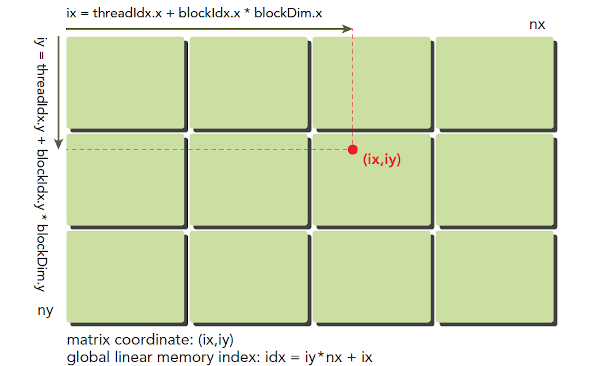

# 线程索引计算

- threadIdx.x、threadIdx.y、threadIdx.z：当前线程在它的线程块内的索引。
- blockIdx.x、blockIdx.y、blockIdx.z：当前线程块在网格中的索引。
- blockDim.x、blockDim.y、blockDim.z：每个线程块中的线程数量。
- gridDim.x、gridDim.y、gridDim.z：网格的尺寸，以线程块为单位。

## 线程的全局索引计算

### 一维

```cpp
# blockDim.x 线程块x方向的线程数量
# blockIdx.x 当前线程块在网络中的索引
# threadIdx.x 前线程在它的线程块内的索引
int index = threadIdx.x + blockIdx.x * blockDim.x;
```

### 二维

```cpp

const int dataWidth = 10;  // Data array width
const int dataHeight = 4;  // Data array height
float data[dataHeight][dataWidth] = {};

dim3 threadsPerBlock(16, 16); // 每个块 16x16 个线程
dim3 numBlocks((dataWidth + threadsPerBlock.x - 1) / threadsPerBlock.x,
(dataHeight + threadsPerBlock.y - 1) / threadsPerBlock.y);
myKernel<<<numBlocks, threadsPerBlock>>>(data);

# global
__global__ void myKernel(float data[][dataWidth]) {
int xIndex = threadIdx.x + blockIdx.x * blockDim.x;
int yIndex = threadIdx.y + blockIdx.y * blockDim.y;

    if (xIndex < dataWidth && yIndex < dataHeight) {
    // 安全地使用 data[yIndex][xIndex]
    }
}

```

### 三维

```cpp
const int depth = 4;
const int height = 10;
const int width = 10;

dim3 threadsPerBlock(8, 8, 8); 
dim3 numBlocks((width + threadsPerBlock.x - 1) / threadsPerBlock.x, 
               (height + threadsPerBlock.y - 1) / threadsPerBlock.y,
               (depth + threadsPerBlock.z - 1) / threadsPerBlock.z);

__global__ void myKernel(float* data, int width, int height, int depth) {
    int xIndex = blockIdx.x * blockDim.x + threadIdx.x;
    int yIndex = blockIdx.y * blockDim.y + threadIdx.y;
    int zIndex = blockIdx.z * blockDim.z + threadIdx.z;

    if (xIndex < width && yIndex < height && zIndex < depth) {
        int index = zIndex * (width * height) + yIndex * width + xIndex;
        // 使用 data[index] 进行操作
    }
}

```

### 网络和块的限制
```bash

不同的硬件架构有不一样的限制。
nvidia GPU cuda 核函数中网格，线程块数量各有限制
比如块 X 维度最大为 1024。Y 维度最大为 1024Z 维度最大为 64。
比如网格 X 维度最大为 65535。Y 维度最大为 65535。Z 维度最大为 65535。
```

### 全局一位索引
```angular2html
int tid = tid_x + tid_y * gridDim.x * blockDim.x + tid_z * gridDim.x * blockDim.x * gridDim.y * blockDim.y
```

```angular2html
int tid = tid_x + tid_y * gridDim.x * blockDim.x + tid_z * gridDim.x * blockDim.x * gridDim.y * blockDim.y + tid_w * gridDim.x * blockDim.x * gridDim.y * blockDim.y * gridDim.z * blockDim.z;
```


##  线程的索引方式

- 为了便于定位thread和block，需要对thread和block建立索引作为它们的唯一标识。首先需要介绍几个CUDA中内置的结构体，使用它们对线程进行索引

    - `gridDim`：grid的维度大小

        - 根据grid的形状，结构体`gridDim`可以包含三个整数变量:`gridDim.x`、`gridDim.y`、`gridDim.z`，分别表示grid在`x`、`y`、`z`三个方向上的可以容纳block的数量。

    - `blockDim`：block的维度大小

        - 根据block的形状，结构体`blockDim`可以包含三个整数变量:`blockDim.x`、`blockDim.y`、`blockDim.z`，分别表示block在`x`、`y`、`z`三个方向上的可以容纳thread的数量。

    - `blockIdx`：block在grid内的位置索引

        - 根据grid的形状，`blockIdx`可以包含三个整数变量：`blockIdx.x`、`blockIdx.y`、`blockIdx.z`，分别表示block处于grid中`x`、`y`、`z`三个方向上的位置。

    - `threadIdx`：thread在所在block中的为欧洲索引

        - 根据block的形状，`threadIdx`可以包含三个整数变量：`threadIdx.x`、`threadIdx.y`、`threadIdx.z`，分别表示thread处于block中`x`、`y`、`z`三个方向上的位置。

          > 注意：`gridDim.x`指的是grid形状的第一维的长度，如果是二维grid，则表示grid一行包含`gridDim.x`个块，也就是grid的列长。

- 一维grid和一维block

    - 这是最简单的线程组织形式。

    - 在这种情况下，任意一个thread在block中的编号为`threadIdx.x`，每个block包含`blockDim.x`个thread。

    - 在这种情况下，任意一个block在grid中的编号为`blockIdx.x`，每个grid包含`gridDim.x`个block。

    - 那么，任意一个线程在grid中的编号应该是`blockIdx.x * gridDim.x + threadIdx.x`。

    - 下图为一个`gridDim.x = 4`、`blockDim.x = 8`的线程布局

      

- 二维grid和二维block

    - 这种方式的线程布局如下图所示所示。

      

    - 在这种情况下，任意一个thread处在block中的`threadIdx.x`行、`threadIdx.y`列的位置，每个block又处在grid中第`blockIdx.x`行和`blockIdx.y`列的位置。

    - 那么，任意一个thread在block中的编号为`threadIdx.y * blockDim.x + blockDim.x`。

    - 同理，任意一个block在grid中的编号为`blockIdx.y * gridDim.x + gridDim.x`。

    - 任意一个thread在grid中处在`blockIdx.x * gridDim.x + threadIdx.x`行、`blockIdx.y * gridDim.y + threadIdx.y`列的位置。

    - 任意一个thread在grid中标号为`(blockIdx.x + blockIdx.y * gridDim.x) * (blockDim.x * blockDim.y)  + (threadIdx.y * blockDim.x) + threadIdx.x`

      > 解释如下：对于一个线程，其所在的block的编号为`(blockIdx.x + blockIdx.y * gridDim.x)`，所以其前面编号那么多个块，每个块包含`(blockDim.x * blockDim.y)`个线程，所以前面的所有块包含`(blockIdx.x + blockIdx.y * gridDim.x) * (blockDim.x * blockDim.y)`个线程，再加上该线程在当前块中的编号`(threadIdx.y * blockDim.x) + threadIdx.x`即可得到该线程在整个grid中的编号。

- 三维grid和三维block

    - 在这种情况下，任意一个block在grid中的编号为`blockIdx.x + blockIdx.y * gridDim.x + gridDim.x * gridDim.y * blockIdx.z`。
    - 任意一个thread在grid中的编号为`(blockIdx.x + blockIdx.y * gridDim.x + gridDim.x * gridDim.y * blockIdx.z) * (blockDim.x * blockDim.y * blockDim.z) + (threadIdx.z * (blockDim.x * blockDim.y)) + (threadIdx.y * blockDim.x) + threadIdx.x`。

- 其他的划分方式的索引可以以此类推。